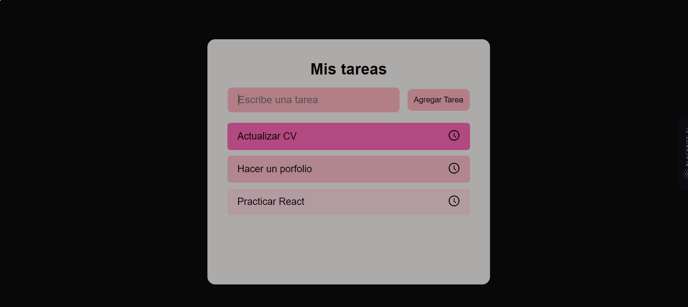

# React Todo List

A task management web application built with React, HTML5, CSS3, JavaScript, and Sass. This app allows users to manage their tasks and to-do items effectively.

## Features

- Add, edit, and delete tasks.
- Mark tasks as completed.
- User-friendly interface with improved design.
- Responsive layout for various screen sizes.

## Technologies Used 🛠️

-  React: JavaScript library for building user interfaces.
-  Sass: CSS extension language with additional features.
-  HTML5: Markup language for structuring the web page.
-  JavaScript: Programming language for building dynamic websites.
-  CSS3: Styling language for design and presentation.

## Usage Instructions

1. Clone this repository using the command: `git clone https://github.com/yourusername/todo-list-react.git`
2. Navigate to the project directory: `cd todo-list-react`
3. Install the dependencies: `npm install`
4. Start the application: `npm start`
5. Open your web browser and go to `http://localhost:3000` to use the updated todo list.

## Customization

Feel free to customize and enhance the todo list application in various ways:

- Implement task priorities or due dates.
- Add a search or filtering feature for tasks.
- Integrate data persistence using local storage or a backend server.
- Explore different styles and themes using Sass variables.

## Contributions

Contributions are welcome! If you have suggestions, bug reports, or want to contribute in any way, please submit a pull request.

## Author ✒️

- **Your Name** - [Carmenyo](https://github.com/carmenyo)

